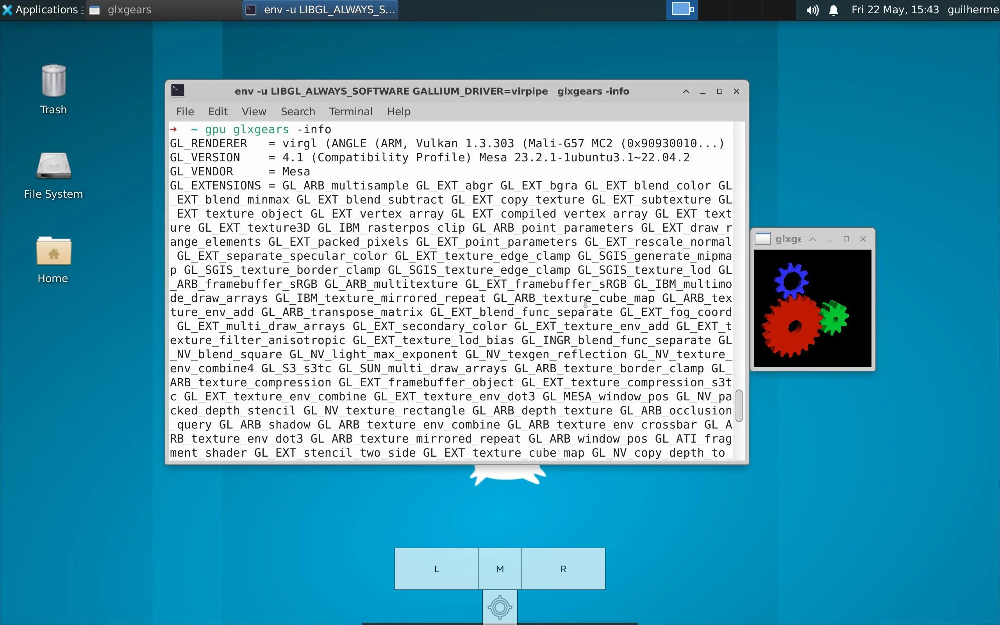
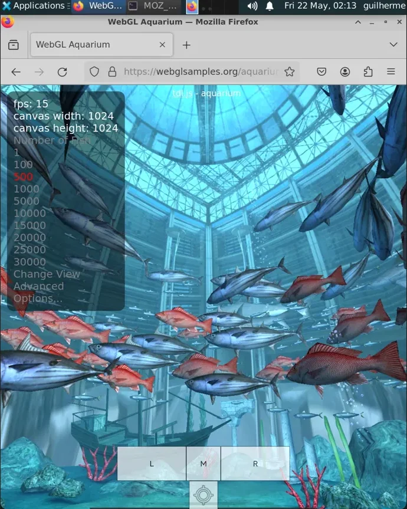

# Mali GPU acceleration in Termux + proot (no root)

A complete, end-to-end guide to running a **hardware-accelerated Linux desktop**
(XFCE) on an Android phone with a **Mali GPU**, inside Termux + a proot distro,
**without root**.

Most Termux GPU guides assume a Qualcomm **Adreno** GPU (Turnip, Zink, the
`/dev/kgsl` device). On **Mali** none of that exists, OpenGL-over-virgl is
broken, and you hit a wall of `texImage2D 0x0502` / `EGL_BAD_ACCESS` errors.
This repo documents the path that actually works on Mali: routing through
**ANGLE -> Vulkan** with the right ICD fix, plus every desktop-bringup pitfall
that comes after.

> Tested on: **Xiaomi Redmi Pad 2 (MediaTek Helio G100-Ultra, Mali-G57 MC2)**,
> Termux + udroid (Ubuntu 22.04 "jammy") + XFCE4, Android 15 / HyperOS 2,
> no root. The approach should apply to other Mali GPUs without root - see
> [docs/GPU-COMPATIBILITY.md](docs/GPU-COMPATIBILITY.md).

---

## Why this is hard on Mali

Adreno exposes `/dev/kgsl` to userspace, so Termux can talk to the GPU directly
(that's what Turnip uses). **Mali does not.** The only userspace path is
`virglrenderer` wrapping the system's graphics driver - and Mali's OpenGL via
virgl is broken (the `texImage2D ... 0x0502` error). The workaround is to make
**ANGLE translate everything to Vulkan** instead of OpenGL, since Mali's Vulkan
driver is solid. That requires a specific ICD fix so ANGLE can find Mali's
Vulkan; without it, ANGLE silently falls back to the broken GL path.

The render chain ends up being:

```
app (proot) -> Mesa virpipe -> socket -> virgl_test_server -> ANGLE -> Vulkan -> Mali
```

---

## Architecture

| Layer | Renderer | Why |
|---|---|---|
| Desktop shell (panel, WM, wallpaper) | Software (llvmpipe) | 2D, stable, always visible; forcing it through virgl breaks presentation |
| GL / WebGL apps (`gpu <app>`) | Hardware (virgl -> ANGLE -> Vulkan -> Mali) | The GPU pays off here |

The desktop is software; the GPU is applied **per app** on demand.

---

## Proof / Results



*`gpu glxgears -info` confirms the active driver: `GL_RENDERER = virgl (ANGLE (ARM, Vulkan 1.3.303 (Mali-G57 MC2)))` - the full virgl -> ANGLE -> Vulkan -> Mali chain is live, not the broken OpenGL fallback.*



*Firefox running the WebGL Aquarium at ~15 fps with 500 fish - GPU-accelerated rendering under real load, not just a synthetic gears demo.*

---

## Prerequisites

- Termux (from F-Droid or GitHub - **not** the Play Store build)
- The **Termux:X11** companion app
- A proot distro with an XFCE4 desktop. This guide uses
  [udroid](https://github.com/RandomCoderOrg/ubuntu-on-android); `proot-distro`
  works too (adjust the login line in `scripts/start-ubuntu.sh`).

---

## Installation

All commands in steps 0-2 run in **Termux** (the host), not inside the distro.

### 0. Get this repo

```bash
pkg install git
git clone https://github.com/Theguilherm3/termux-mali-gpu-acceleration ~/termux-mali-gpu-acceleration
cd ~/termux-mali-gpu-acceleration
```

### 1. Install the virgl/ANGLE toolkit

```bash
pkg install wget which virglrenderer virglrenderer-android angle-android
cd && rm -f ~/vgl && wget https://github.com/ar37-rs/virgl-angle/raw/refs/heads/main/vgl && chmod +x ~/vgl
```

### 2. The Mali Vulkan ICD fix (make-or-break)

Without this, ANGLE can't initialize Vulkan and falls back to Mali's broken
OpenGL - the exact `texImage2D 0x0502` error. This removes the software ICD,
installs the generic Vulkan loader, and adds the Mesa ICD wrapper:

```bash
pkg remove *icd-swrast && pkg install vulkan-loader-generic wget openssl && \
cd && rm -f ~/mesa-vulkan-icd-wrapper_25.0.0-1_aarch64.deb && \
wget https://github.com/ar37-rs/virgl-angle/releases/download/latest/mesa-vulkan-icd-wrapper_25.0.0-1_aarch64.deb && \
dpkg -i ~/mesa-vulkan-icd-wrapper_25.0.0-1_aarch64.deb
```

(This one-liner is the documented fix from
[ar37-rs/virgl-angle issue #1](https://github.com/ar37-rs/virgl-angle/issues/1).)

> Note: `pkg remove *icd-swrast` relies on the shell passing the unmatched glob
> through to `apt`, which then matches the package name. If your shell sets
> `failglob` or `nullglob` differently from Termux's default, quote it:
> `pkg remove '*icd-swrast'`.

### 3. Install the launch scripts

Put `scripts/start-ubuntu.sh` in your Termux home (`~`) and
`scripts/start-xfce.sh` in your distro home (`/home/<you>/`). **Edit the two
variables** at the top of `start-ubuntu.sh` (`USER_NAME`, `UDROID_DISTRO`).

```bash
# In Termux:
cp scripts/start-ubuntu.sh ~/ && chmod +x ~/start-ubuntu.sh
```

`start-xfce.sh` goes inside the distro - copy it to `/home/<you>/start-xfce.sh`
and `chmod +x` it there.

### 4. Per-app GPU wrapper (inside the distro)

Add the alias from `config/gpu.alias` to your `~/.zshrc` (or `~/.bashrc`).
Guarded so re-running the install doesn't duplicate the line:

```bash
grep -q "alias gpu=" ~/.zshrc 2>/dev/null || \
  echo "alias gpu='env -u LIBGL_ALWAYS_SOFTWARE GALLIUM_DRIVER=virpipe MESA_GL_VERSION_OVERRIDE=4.1COMPAT MESA_GLSL_VERSION_OVERRIDE=410'" >> ~/.zshrc
source ~/.zshrc
```

### 5. Run it

From Termux:

```bash
./start-ubuntu.sh
```

The desktop should come up. Open a terminal in it and verify (see below).

---

## Usage

Run a GL/WebGL app on the GPU by prefixing it with `gpu`:

```bash
gpu glxgears
gpu blender
```

For Firefox with accelerated WebGL, use `config/firefox-gpu` (instructions in
that file). To make a panel/menu icon always launch accelerated, see
[docs/TROUBLESHOOTING.md](docs/TROUBLESHOOTING.md#firefox-icon-still-opens-in-software).

---

## Verifying acceleration

Inside the desktop, open a terminal:

```bash
gpu glxgears -info     # first line GL_RENDERER should say: virgl (Mali-...)
```

If the gears spin and `GL_RENDERER` reads `virgl (Mali-...)`, you have working
hardware acceleration. (`glxinfo` may throw `X_GetImage BadMatch` - that's a
cosmetic quirk of that tool under virgl, not a real failure. `glxgears` and
WebGL render fine.)

---

## Honest limitations

- **No video decode acceleration.** This accelerates GL/WebGL *rendering*, not
  video *decode* - there is no VA-API through virgl. HD video on YouTube will
  stutter regardless of browser. Mitigate with lower resolution,
  `enhanced-h264ify`, or `mpv` + `yt-dlp`.
- **virgl overhead caps the FPS.** Expect roughly 10% of native GPU throughput;
  the WebGL Aquarium runs ~15 fps with 500 fish. The bottleneck is the
  guest -> socket -> server -> ANGLE -> Vulkan bridge, not the chip.
- **`virgl_fence_set_fd: failed err=-9`** in logs is a known virgl limitation
  (fence export). It's noise from accelerated apps; it doesn't break the
  desktop.
- **No session-manager logout.** We skip xfce4-session for stability, so the
  panel's shutdown/restart buttons are inert. Close via the Termux:X11 app or
  Ctrl+C. The trade: a deterministic boot every time.

---

## Credits

- [**ar37-rs/virgl-angle**](https://github.com/ar37-rs/virgl-angle) - the `vgl`
  toolkit and the Mali Vulkan ICD wrapper that make this possible.
- The [Termux team](https://github.com/termux) and maintainers.
- [xNul](https://github.com/termux/termux-packages/issues/23042) - documented
  the Mali OpenGL/ANGLE bug and the ICD fix on another Mali device (Mali-G715).

## License

MIT - see [LICENSE](LICENSE).
